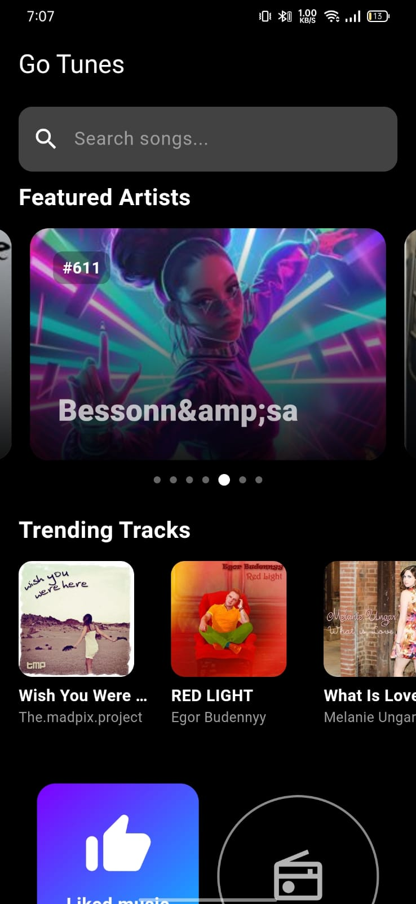
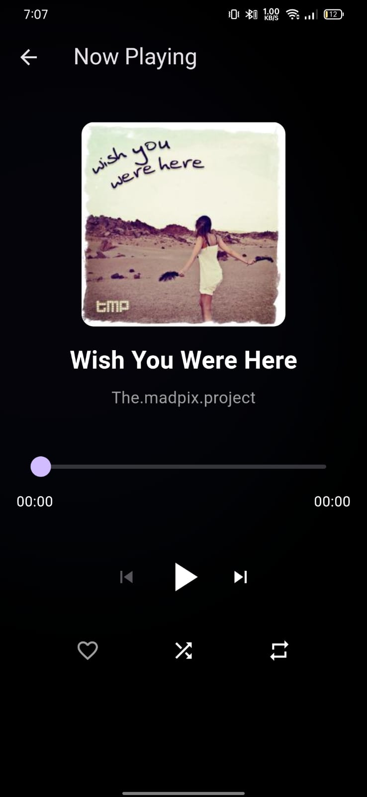
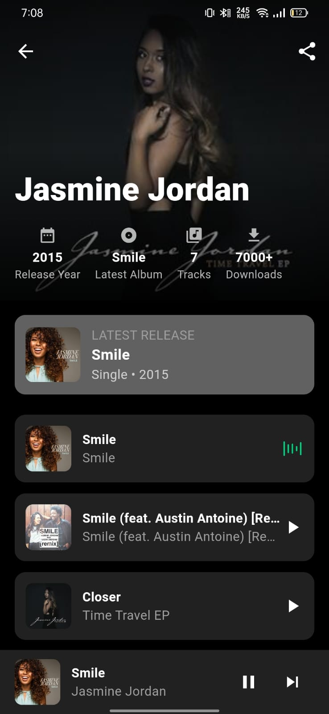
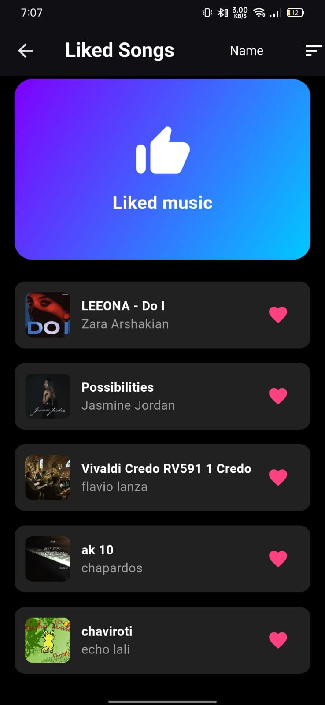

# 🎧 GO Tunes - Flutter Music Player App

**GO Tunes** is a sleek and modern Flutter music player app built with `Provider`, `AudioPlayers`, and `SharedPreferences`. It supports audio streaming, offline caching, liking tracks, shuffling, and repeat modes – all packed into a smooth Material Dark UI.

---

## 📸 Screenshots

| Home | Now Playing | Artist Home | Liked Tracks |
|------|-------------|--------------|------------------|
|  |  |  |  |

---
## 📖 Story Behind GO Tunes

I created **GO Tunes** because I was frustrated with most music players being overloaded with ads and poor performance. I wanted a music app that was clean, ad-free, and fully focused on delivering high-quality audio.

This app ensures:

- 🎵 **All liked songs are downloaded locally**, so you can enjoy them offline.
- 🔊 **High-resolution audio playback** with **zero distortion**, even at full volume.
- 💡 **Bug-free experience** – I’ve focused on both **functionality** and a **complete dark UI**.
- 🛠️ If you find any issues, feel free to report them – I'm committed to making this app better.

You can email me at: **`Pankajsheokand2005@gmail.com`**


## 🎬 Demo Video

> Click the video below to preview the app in action:

[](https://youtube.com/shorts/NDSNYR7nXUA?si=0eE5NLtXzC76c-tV)

---

## 📱 Download APK

You can install the app on any Android device using the link below:

📦 [Download GO Tunes APK](assets/preview/apk/app-release.apk)

---

## ✨ Features

- 🔊 Audio streaming with offline caching
- ❤️ Like/favorite tracks with local persistence
- 🔁 Shuffle, Repeat One, Repeat All
- ⏱️ Real-time seekbar with duration and progress
- 🎨 Dark mode theme
- 📂 Clean and scalable folder structure

---

## 🧱 Folder Structure

```text
lib/
├── models/        # Track and other data models
├── provider/      # AudioProvider (handles playback logic & state)
├── screens/       # Home screen and others
├── services/      # Logic or helpers (e.g., for parsing or APIs)
├── widgets/       # Reusable components like buttons or sliders
└── main.dart      # App entry point
````

---

## 🚀 Getting Started

### 🔧 Prerequisites

* Flutter SDK (stable)
* Android Studio or VS Code
* Android device or emulator

### ▶️ Run Locally

```bash
git clone https://github.com/Pankaj1662005/Go-tunes
cd Go-tunes
flutter pub get
flutter run
```

---

## 📦 Dependencies

* [`audioplayers`](https://pub.dev/packages/audioplayers)
* [`flutter_cache_manager`](https://pub.dev/packages/flutter_cache_manager)
* [`provider`](https://pub.dev/packages/provider)
* [`shared_preferences`](https://pub.dev/packages/shared_preferences)

---

## 📄 License

This project is licensed under the MIT License - see the [LICENSE](LICENSE) file for details.

---

## 🙌 Author

Built with ❤️ by [Pankaj1662005](https://github.com/Pankaj1662005)
contact : Pankajsheokand2005@gmail.com
